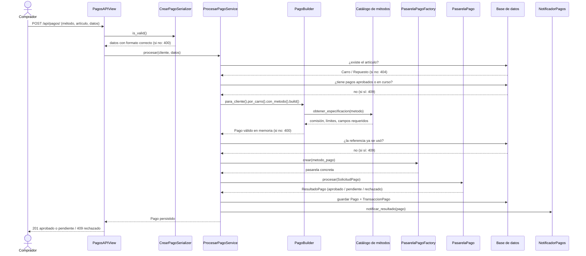

# Módulo de pagos

Documentación técnica del flujo de cobro de CarFit: cómo está organizado, por
qué así, y qué hay que tocar para cambiarlo.

## 1. Qué resuelve

Un comprador paga un carro o un repuesto publicado en el marketplace. El
sistema debe soportar **varios métodos de pago** con reglas distintas, hablar
con **proveedores externos** que pueden fallar, y no cobrar dos veces bajo
ninguna circunstancia.

Métodos soportados hoy:

| Método | Comisión | Rango | Cuotas | Confirma en el momento |
|---|---|---|---|---|
| Tarjeta de crédito | 2,9% + $900 | $1.500 a $200.000.000 | hasta 36 | Sí |
| Tarjeta débito | 1,9% + $900 | $1.500 a $50.000.000 | No | Sí |
| PSE | $2.500 | $5.000 a $500.000.000 | No | No |
| Billetera digital | 1,75% | $1.000 a $10.000.000 | No | Sí |
| Efectivo en corresponsal | $4.500 | $5.000 a $4.000.000 | No | No |

## 2. Estructura de carpetas

```
marketplace/
├── api/                       # Capa de Presentación (DRF)
│   ├── serializers.py         #   valida formato, nunca negocio
│   ├── views.py               #   APIView: HTTP entra, HTTP sale
│   ├── errores.py             #   único lugar que traduce dominio -> códigos HTTP
│   └── urls.py
├── services.py                # Capa de Aplicación
│   ├── ProcesarPagoService    #   el caso de uso completo
│   ├── ConfirmarPagoService   #   resuelve PSE y efectivo
│   ├── ConsultarPagoService
│   ├── CatalogoMetodosPagoService
│   └── BitacoraPagos          #   auditoría, separada del cobro
├── domain/                    # Capa de Dominio (sin HTTP, sin proveedores)
│   ├── metodos_pago.py        #   catálogo: comisiones, límites, requisitos
│   ├── builders.py            #   PagoBuilder (Builder + Fluent Interface)
│   ├── ports.py               #   PasarelaPago, NotificadorPagos, SolicitudPago
│   └── exceptions.py
├── infra/                     # Infraestructura reemplazable
│   ├── pasarelas.py           #   Simulada / Agregador / Corresponsal
│   ├── notificadores.py       #   comprobante por consola o correo
│   └── factories.py           #   PasarelaPagoFactory, NotificadorPagosFactory
└── models.py                  # Persistencia: Pago y TransaccionPago
```

La regla que ordena todo: **las dependencias apuntan hacia el dominio**. La
API conoce a los servicios, los servicios conocen al dominio, y el dominio no
conoce a nadie. `infra/` implementa interfaces que declara el dominio, así que
la flecha también apunta hacia adentro.

## 3. Diagrama de secuencia: `POST /api/pagos/`



Tres detalles que el diagrama hace evidentes:

1. **La llamada a la pasarela ocurre fuera de la transacción de base de
   datos.** Mantener una transacción abierta mientras se espera una respuesta
   de red bloquea filas durante segundos sin ninguna necesidad.
2. **El Builder valida antes de que exista cualquier cobro.** Un pago mal
   armado nunca llega al proveedor.
3. **Un rechazo del emisor no es una excepción.** Es un desenlace válido: se
   registra, se notifica, y la vista lo representa con 409.

## 4. Patrones creacionales

### Builder: `PagoBuilder`

Un pago tiene invariantes que dependen unas de otras: el monto lo fija el
artículo, la comisión el método, los datos obligatorios el método, y las
cuotas dependen de si el método las acepta. Con `Pago(**request.data)` esas
reglas terminan repartidas entre la vista, el serializer y el modelo.

`PagoBuilder` las concentra y garantiza que `build()` solo devuelva pagos
consistentes, reportando **todos** los errores de una vez en lugar de uno por
petición.

```python
pago = (PagoBuilder()
        .para_cliente(cliente)
        .por_carro(carro)
        .con_metodo("TARJETA_CREDITO", {"token_tarjeta": "tok_123"})
        .con_cuotas(12)
        .build())
```

### Factory: `PasarelaPagoFactory`

Decide en dos ejes a la vez:

* **Qué método se paga**: una tarjeta va contra un agregador; el efectivo
  genera un código de recaudo. Son integraciones distintas.
* **En qué entorno corre**: `PASARELA_PAGO=MOCK` sustituye ambas por una
  pasarela simulada, determinista y sin red, para desarrollo y pruebas.

Sin la Factory, ese doble eje sería una cadena de `if/elif` dentro de
`services.py`. Con ella es un mapa de dos niveles: agregar un método nuevo es
apuntarlo a una pasarela lógica en el catálogo del dominio; agregar un
proveedor nuevo es una entrada más en el registro. Ni el servicio ni la API
cambian.

## 5. Cómo se evita el doble cobro

Tres barreras, de la más barata a la más definitiva:

1. **Disponibilidad del artículo**: si ya tiene un pago `APROBADO` o
   `PENDIENTE`, se responde 409 antes de tocar la pasarela.
2. **Referencia de idempotencia**: el cliente puede enviar `referencia`. Si
   ya existe, se responde 409 sin cobrar. Si no la envía, CarFit genera una.
3. **Restricción de unicidad en la base de datos**: dos peticiones
   simultáneas con la misma referencia hacen que la segunda falle en el
   `INSERT`, y esa falla se traduce también a 409.

## 6. Preparación para un API Gateway

* **Prefijo propio**: toda la API vive bajo `/api/`, separada del front web.
  Un gateway puede enrutar `/api/pagos/*` hacia un servicio de pagos
  independiente sin conocer su implementación.
* **Sin estado en el servidor de aplicación**: cada petición trae lo que
  necesita, así que se puede escalar horizontalmente detrás del gateway.
* **Errores uniformes**: todas las respuestas de error tienen la misma forma
  (`{"error": ..., "detalles": [...]}`) y usan códigos HTTP estándar, que es
  lo que un gateway necesita para aplicar políticas de reintento: 503 se
  reintenta, 409 jamás.
* **Idempotencia explícita**: el campo `referencia` permite que el gateway o
  el cliente reintenten sin riesgo de cobrar dos veces, requisito de
  cualquier política de reintentos automáticos.
* **Servicios sin HTTP**: `ProcesarPagoService` recibe un `Cliente` y un
  diccionario. El día que los pagos se extraigan a su propio microservicio,
  la lógica se mueve intacta y solo cambia el transporte.

## 7. Contrato de la API

### `GET /api/pagos/metodos/`

Catálogo de métodos. Acepta `?monto=` para filtrar los que aplican.

```json
{
  "metodos": [
    {
      "codigo": "TARJETA_CREDITO",
      "etiqueta": "Tarjeta de crédito",
      "comision_porcentual": "0.0290",
      "comision_fija": 900,
      "monto_minimo": 1500,
      "monto_maximo": 200000000,
      "campos_requeridos": ["token_tarjeta"],
      "permite_cuotas": true,
      "cuotas_maximas": 36,
      "confirmacion_inmediata": true
    }
  ]
}
```

### `POST /api/pagos/`

```json
{
  "metodo_pago": "TARJETA_CREDITO",
  "carro": 1,
  "cuotas": 12,
  "token_tarjeta": "tok_prueba_123",
  "referencia": "CF-OPCIONAL-1"
}
```

| Código | Cuándo |
|---|---|
| 201 | El pago quedó aprobado o pendiente de confirmación |
| 400 | Formato inválido, método no soportado, faltan datos del método, cuotas fuera de rango, monto fuera de los límites |
| 404 | El carro o el repuesto no existe; el usuario no tiene perfil de cliente |
| 409 | Artículo ya vendido, referencia repetida, o transacción rechazada por el emisor |
| 503 | La pasarela no respondió |

### `GET /api/pagos/` · `GET /api/pagos/<referencia>/`

Historial del cliente autenticado y detalle de un pago propio. Un pago de otro
cliente responde 404, no 403: responder distinto permitiría descubrir qué
referencias existen probando una por una.

### `POST /api/pagos/<referencia>/confirmar/`

Resuelve un pago pendiente preguntándole a la pasarela. 200 si se actualizó,
409 si el pago ya estaba resuelto, 404 si no existe.

### `GET /api/pagos/<referencia>/factura/`

Factura del pago (`Pago.Generar_Factura()` del diagrama de clases). Es un
objeto de valor del dominio (`domain/facturas.py`), no una tabla: se
reconstruye a partir del `Pago` en cada petición. 200 si el pago está
aprobado, 409 si no lo está, 404 si no existe. La versión web
(`/pagos/<referencia>/factura/`) la muestra en una página imprimible.
