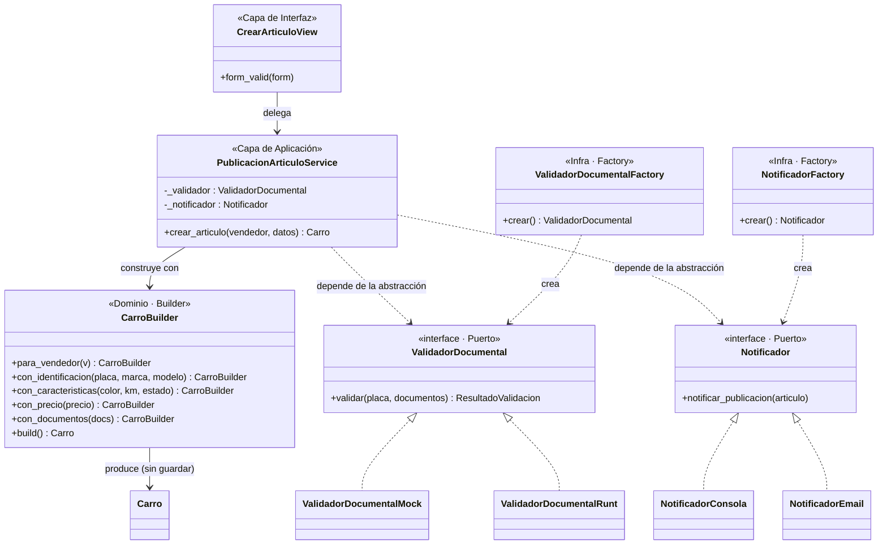
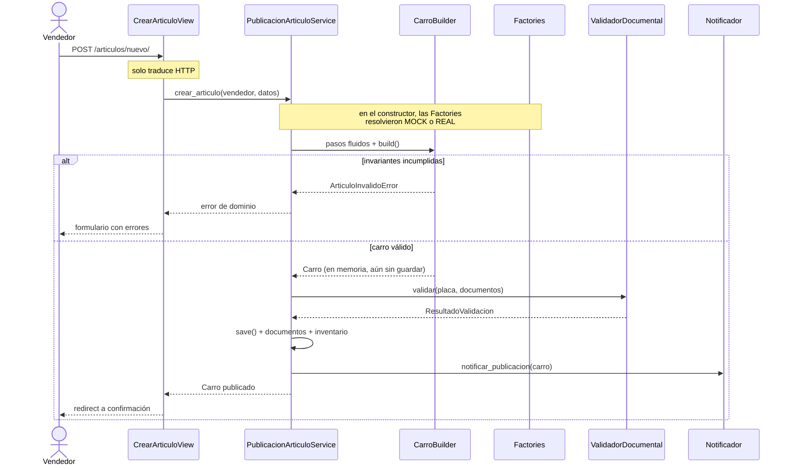

# Implementación del Patrón Creacional

**Módulo:** Publicación de Artículos (`Crear_Articulo` del Vendedor)
**Proyecto:** CarFit — marketplace de carros y repuestos
**Taller 01 — Arquitectura de Software 2026**

---

## 1. El problema

`Crear_Articulo` es el flujo más complejo de CarFit. Publicar un vehículo no es
un simple `INSERT`: hay que validar el formato de la placa, verificar que un
carro declarado NUEVO no traiga 80.000 km, exigir que el SOAT y la
tecnomecánica estén presentes y vigentes, actualizar el inventario del vendedor
y notificarle que su artículo quedó publicado.

En el enfoque monolítico todo eso vivía en la vista:

```python
# ANTES — todo mezclado en la vista
def crear_articulo(request):
    if request.method == "POST":
        placa = request.POST["placa"]
        if len(placa) != 6:                      # validación de negocio en la vista
            return render(request, "error.html")
        if request.POST["estado"] == "NUEVO" and int(request.POST["kilometraje"]) > 1000:
            return render(request, "error.html")
        soat_vence = parse_date(request.POST["soat_vencimiento"])
        if soat_vence < date.today():            # regla legal en la vista
            return render(request, "error.html")
        carro = Carro(...)                       # objeto que pudo nacer inválido
        carro.save()
        inv = Inventario.objects.get(vendedor=...)
        inv.cantidad_carro += 1                  # acceso a datos en la vista
        inv.save()
        send_mail(...)                           # dependencia externa incrustada
```

Tres consecuencias concretas:

1. **No se puede probar.** Cualquier test envía un correo real.
2. **Las reglas no se reutilizan.** Si mañana se publica un artículo desde una
   API o un comando de consola, hay que copiar y pegar las validaciones.
3. **Se pueden crear objetos inválidos.** `Carro(...)` acepta cualquier cosa;
   la validez depende de que quien llame se acuerde de validar antes.

---

## 2. La solución arquitectónica

### Diagrama de clases



### Flujo de interacción



---

## 3. Patrón Builder — `domain/builders.py`

`CarroBuilder` construye el objeto paso a paso con **Fluent Interface** (cada
método devuelve `self`) y **garantiza que `build()` solo devuelve instancias
válidas**:

```python
carro = (CarroBuilder()
         .para_vendedor(vendedor)
         .con_identificacion("ABC123", "Mazda", "CX-30")
         .con_caracteristicas("Rojo", 15_000, "USADO")
         .con_precio(85_000_000)
         .con_documentos(documentos)
         .build())          # <- valida TODO aquí; si algo falla, lanza y no devuelve nada
```

### Decisiones de diseño

| Decisión | Justificación |
|---|---|
| `build()` **no** llama a `.save()` | El dominio no debe conocer la persistencia. Devuelve un objeto en memoria y el Service decide cuándo y dentro de qué transacción guardarlo. Además permite probar las reglas **sin base de datos** (`SimpleTestCase`). |
| Se acumulan **todos** los errores | Un `raise` en la primera falla obliga al vendedor a corregir de a un campo por intento. `ArticuloInvalidoError` lleva la lista completa. |
| Normaliza entradas (`.upper()`, `.strip()`) | `"abc123"` y `"ABC123"` son la misma placa. Normalizar en el Builder evita duplicados en la base de datos. |
| Las reglas viven aquí y no en el `Form` | Un `ModelForm` solo protege el flujo web. Estas reglas también aplican si el artículo se crea desde un comando o una API. El formulario valida **formato**; el Builder valida **negocio**. |

---

## 4. Patrón Factory — `infra/factories.py`

El servicio necesita un validador documental y un notificador, pero **no debe
saber cuáles**. Las Factories son el único punto del sistema que conoce las
clases concretas, y eligen según **variables de entorno**:

```python
class NotificadorFactory:
    VARIABLE_ENTORNO = "NOTIFICADOR"
    _registro = {"MOCK": NotificadorConsola, "REAL": NotificadorEmail}

    @classmethod
    def crear(cls, tipo=None):
        clave = (tipo or os.getenv(cls.VARIABLE_ENTORNO, "MOCK")).upper()
        return cls._registro[clave]()
```

### Cambio de comportamiento demostrable

```bash
# Desarrollo: aprueba los documentos e imprime el correo en consola
VALIDADOR_DOCUMENTAL=MOCK NOTIFICADOR=MOCK python manage.py runserver

# Producción: verifica vigencia real del SOAT y envía correo de verdad
VALIDADOR_DOCUMENTAL=REAL NOTIFICADOR=REAL python manage.py runserver
```

Ni el servicio ni la vista cambian una sola línea.

### Decisiones de diseño

| Decisión | Justificación |
|---|---|
| Registro por diccionario en vez de `if/elif` | Agregar un `NotificadorSMS` es una entrada nueva en el mapa, no editar la factory: **abierta a extensión, cerrada a modificación** (la O de SOLID). |
| Dos factories y no una genérica | Cada una tiene su propia variable de entorno y su propio default. Una factory genérica obligaría a pasar strings mágicos desde el servicio. |
| Falla ruidosamente ante un valor inválido | `NOTIFICADOR=REALL` levanta `ValueError` con las opciones válidas, en vez de caer silenciosamente al mock y no enviar correos en producción. |
| Default `MOCK` | Lo seguro por defecto: un despliegue mal configurado imprime en consola en lugar de mandar correos indeseados. |

---

## 5. Service Layer y SOLID — `services.py`

```python
class PublicacionArticuloService:
    def __init__(self, validador=None, notificador=None):
        # Inyección de dependencias con default resuelto por las Factories
        self._validador = validador or ValidadorDocumentalFactory.crear()
        self._notificador = notificador or NotificadorFactory.crear()

    @transaction.atomic
    def crear_articulo(self, vendedor, datos):
        ...
```

| Principio | Cómo se cumple |
|---|---|
| **S** — Responsabilidad única | La vista traduce HTTP. El servicio orquesta. El Builder valida. `infra/` habla con el mundo exterior. |
| **O** — Abierto/cerrado | Un nuevo notificador se agrega sin modificar servicio ni factory. |
| **L** — Sustitución de Liskov | `NotificadorConsola` y `NotificadorEmail` son intercambiables: el servicio funciona igual con cualquiera. |
| **I** — Segregación de interfaces | `Notificador` expone un solo método. No obliga a implementar operaciones que no se usan. |
| **D** — Inversión de dependencias | El servicio depende de los puertos de `domain/ports.py`, no de las clases de `infra/`. |

**`@transaction.atomic`:** si la validación documental falla después de haber
guardado el carro, la transacción revierte todo. Sin esto quedarían vehículos
publicados sin documentos y el inventario descuadrado.

---

## 6. La vista: 13 líneas

```python
class CrearArticuloView(LoginRequiredMixin, FormView):
    template_name = "marketplace/crear_articulo.html"
    form_class = CrearArticuloForm
    success_url = reverse_lazy("marketplace:articulo_publicado")
    service_factory = PublicacionArticuloService   # inyectable desde los tests

    def form_valid(self, form):
        try:
            self.service_factory().crear_articulo(
                self.request.user.vendedor, form.cleaned_data
            )
        except ErrorDeDominio as error:
            form.add_error(None, str(error))
            return self.form_invalid(form)
        return super().form_valid(form)
```

No hay una sola regla de negocio. `service_factory` es un atributo de clase, así
que los tests inyectan un doble sin tocar el código de producción:

```python
CrearArticuloView.as_view(service_factory=lambda: ServicioFalso())
```

---

## 7. Resultado

**31 pruebas, todas verdes, ninguna envía correos ni consulta servicios externos.**

| Suite | Qué demuestra |
|---|---|
| `test_builders.py` | Las invariantes del dominio, sin tocar la base de datos (`SimpleTestCase`). |
| `test_factories.py` | El comportamiento cambia con la variable de entorno. |
| `test_services.py` | La orquestación y el rollback transaccional, con dobles inyectados. |
| `test_views.py` | La vista delega y traduce errores; nada más. |

Lo que antes era una vista de ~40 líneas imposible de probar hoy son cuatro
piezas con una responsabilidad clara cada una — y las reglas de negocio de
CarFit quedaron en un solo lugar donde se pueden leer, probar y cambiar.
